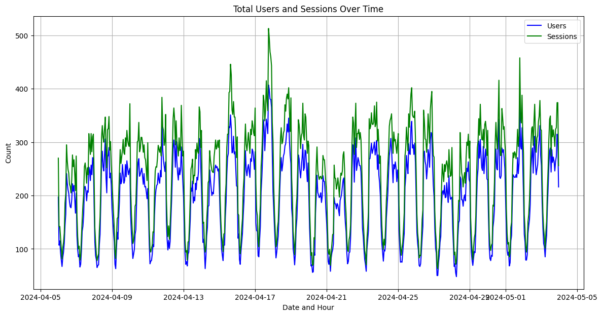
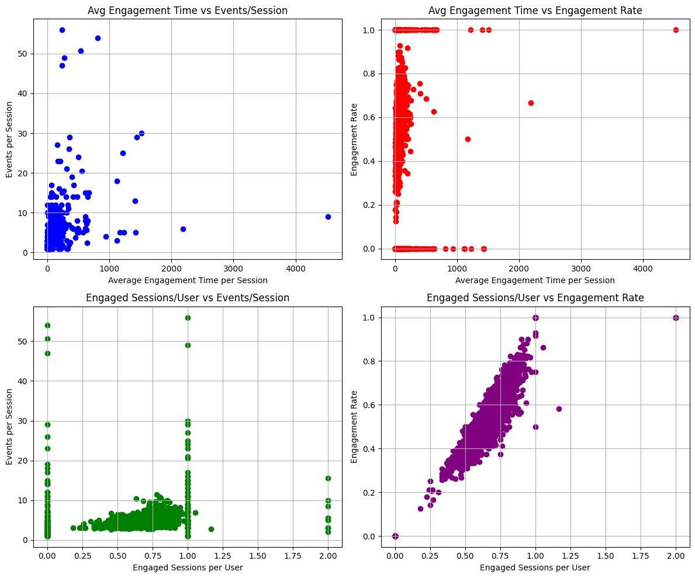
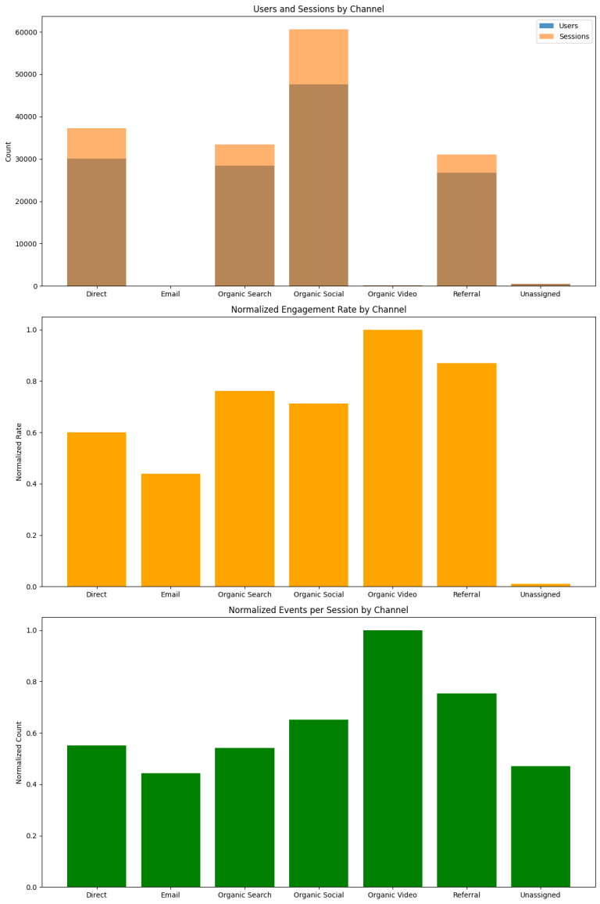
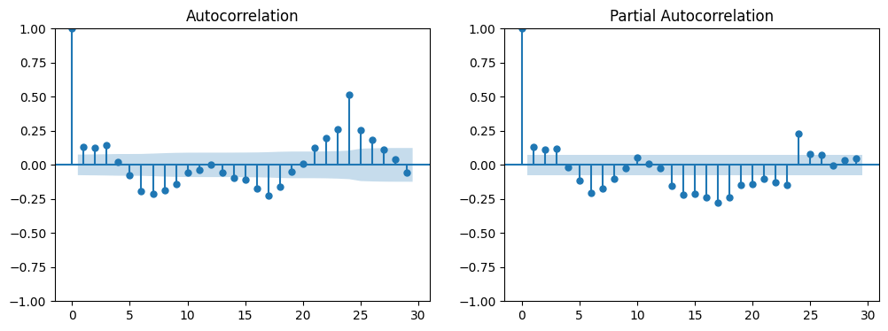
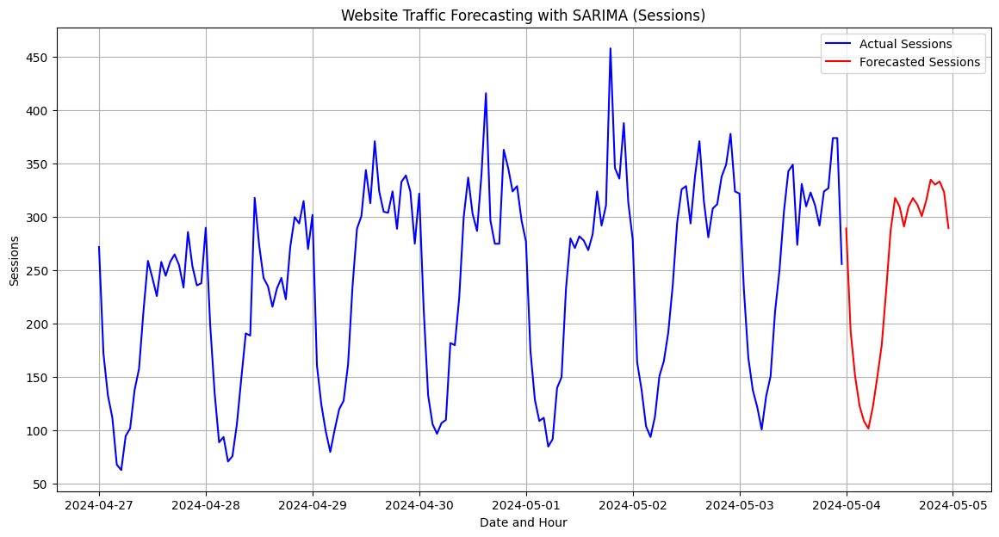

# Website performance analysis:
- Website performance analysis is the process of measuring how fast and efficiently your website loads for visitors. It involves a variety of factors that impact user experience, including page load speed, responsiveness, and stability.
- Website Performance Analysis involves evaluating various metrics related to a website’s functionality, user engagement and overall success in achieving business goals. This form of analysis is critical because it directly impacts user experience, conversion rates, and the profitability and reputation of a business.
- So, if you want to learn how to analyze the performance of a website, this repository is for you.

## Here are some of the benefits of conducting a website performance analysis:
- Improved user experience: Faster loading times and a more responsive website lead to happier visitors who are more likely to stay on your site and convert into customers.
- Enhanced SEO: Search engines consider website speed as a ranking factor, so a faster website can lead to higher search rankings.
- Increased conversions: Studies have shown that slow loading times can lead to a significant drop in conversions. By improving your website's performance, you can increase the number of visitors who take the desired action on your site, such as making a purchase or signing up for a newsletter.

## Dataset: 
- Dataset is from 'Statso'.
- Statso is a Data Science Community to Find Case Studies, Datasets and more!

## Getting started:
The dataset we are working on contains the following columns:

- Session primary channel group: The marketing channel (e.g., Direct, Organic Social)
- Date + hour (YYYYMMDDHH): The specific date and hour of the session
- Users: Number of users in a given period
- Sessions: Number of sessions in that period
- Engaged sessions: Number of sessions with significant user engagement
- Average engagement time per session: The average time a user is engaged per session
- Engaged sessions per user: Ratio of engaged sessions to total sessions per user
- Events per session: Average number of events (actions taken) per session
- Engagement rate: The proportion of sessions that were engaged
- Event count: Total number of events during the period

### Step 1: 
- Import required libraries
- And load the dataset.

### Step 2:
- print(data.head()): There are some errors in the first row of the dataset, which usually occurs while collecting the data from websites. The data starts from the second row, let’s prepare it accordingly:
- Grab the first row for the header
- Take the data less the header row
- Set the header row as the df header

### Step 3:
- Converting the date column into an appropriate datetime format and group it for further analysis:
- data['Date + hour (YYYYMMDDHH)'] = pd.to_datetime(data['Date + hour (YYYYMMDDHH)'], format='%Y%m%d%H')
- data['Users'] = pd.to_numeric(data['Users'])
- data['Sessions'] = pd.to_numeric(data['Sessions'])
- grouped_data = data.groupby(data['Date + hour (YYYYMMDDHH)']).agg({'Users': 'sum', 'Sessions': 'sum'})  # group data by date and sum up the users and sessions

The overall purpose of the above operation is to prepare and summarize the dataset for time series analysis, focusing on how user engagement (through sessions) varies by time. By converting data into appropriate types and grouping it by time, you can more easily perform operations like plotting time series graphs, calculating moving averages, or applying time series forecasting models.

### Step 4:
- Now, let’s analyze the total users and sessions over time.
- Plotting the aggregated users and sessions over time:

From the graph, we can observe there are some fluctuations in the number of users and sessions, possibly indicating daily cycles or specific high-traffic periods. Both users and sessions appear to follow a similar trend, which is expected as more users generally mean more sessions. Some peaks might correspond to specific marketing activities, promotions, or events.

### Step 5:
Now that we’ve analyzed the session trends, let’s move on to User Engagement Analysis. We will look into metrics like average engagement time per session, engagement rate, and events per session to evaluate how engaged users are when they visit the site:
- Convert relevant columns to numeric for engagement analysis
- Group data by date and calculate mean for engagement metrics
- Plotting engagement metrics
  

### Step 6:
The user engagement analysis provides insights into how visitors interact with the website:
- Average Engagement Time per Session: The time spent per session shows fluctuations over the observed period. There are noticeable peaks, suggesting times when users were particularly engaged, potentially due to specific content releases or events.
- Engaged Sessions per User: This ratio fluctuates slightly but generally indicates that a good portion of sessions per user are engaged. Peaks in this metric could correspond to times when users find the content more relevant or engaging.
- Events per Session: The count of events per session remains relatively consistent but does show some variation. Peaks here could indicate more interactive content or features being used by visitors.
- Engagement Rate: The engagement rate over time shows how many sessions are considered engaged out of the total. There are some ups and downs which may relate to how different content resonates with users or how effective certain user acquisition channels are.

### Step 7:
Analyze the correlations between them:
- plot 1: average engagement time vs events per session
- plot 2: average engagement time vs engagement rate
- plot 3: engaged sessions per user vs events per session
- plot 4: engaged sessions per user vs engagement rate

### Step 8:
Here’s what we can analyze from the above scatter plots:

- Average Engagement Time vs Events per Session: There appears to be a concentration of data points at lower average engagement times with a wide range of events per session. As the average engagement time increases, the number of events per session tends to cluster more narrowly around lower values.
- Average Engagement Time vs Engagement Rate: There is a clear trend where sessions with very low engagement times have a broad range of engagement rates, but as engagement time increases, the engagement rate converges towards higher values.
- Engaged Sessions per User vs Events per Session: Most data points cluster at lower values for both metrics, with few users having a high number of engaged sessions or events per session.
- Engaged Sessions per User vs Engagement Rate: There is a strong positive correlation between engaged sessions per user and engagement rate, especially noticeable at higher values of engaged sessions per user.

### Step 9:
We will now proceed with the Channel Performance Analysis to assess how different marketing channels contribute to traffic and engagement. 
It will involve analyzing the session, user, and engagement data segmented by the marketing channel:
- Group data by channel and aggregate necessary metrics
- Normalize engagement rate and events per session for comparison
- Plotting channel performance metrics
- Users and sessions by channel
- Normalized engagement rate by channel
- Normalized events per session by channel

### Step 10:
The data illustrates significant variations in performance across different channels, highlighting the strengths and weaknesses of each in driving traffic, engaging users, and encouraging interactions. The high performance of ‘Organic Search’ in driving traffic contrasts with its lower relative engagement and events metrics, suggesting quantity over quality of visits. In contrast, ‘Referral’ and ‘Organic Video’ channels, while not leading in volume, excel in engaging users deeply, pointing to potential areas for leveraging these strengths in marketing strategies.

## Forecasting Website Traffic
- It will involve creating a time series model to forecast future values based on the observed session data.
- Let’s start this by plotting the autocorrelation and partial autocorrelation plots of our time series data, which is typically done to help identify the order of an autoregressive integrated moving average for time series models for forecasting:

Here’s how to interpret the above graph:

- PACF (Partial Autocorrelation Function): This plot helps determine the p parameter for the AR part of the model. You look for the lag after which most partial autocorrelations are not significantly different from zero. In our plot, the PACF shows a significant spike at lag 1 and then cuts off, suggesting an AR part of order 1. Therefore, p=1.
- ACF (Autocorrelation Function): This plot helps identify the q parameter for the MA part of the model. You look for the lag after which most autocorrelations are not significantly different from zero. The ACF plot in our case tails off gradually, but considering the first significant spike is essential. Since the spike at lag 1 is significant and there’s a gradual tailing off rather than a sharp cut-off, it suggests a potential MA component. However, the tailing-off nature complicates the exact determination of q, but a starting point of q=1 could be considered.

The other parameter is d, representing seasonality. In our case, as seasonality exists, we can choose the value of d as 1. Now, here’s how we can forecast the website’s traffic for the next 24 hours using the SARIMA model:
- forecast the next 24 hours using the SARIMA model
- plotting the actual data and the SARIMA forecast

So this is how we can analyze the performance of a website and forecast its traffic using Python.

## Summary
Conducted a comprehensive analysis of the website’s performance, based on:

- Session Analysis: Understanding traffic trends.
- User Engagement Analysis: Gauging the depth of user interaction.
- Channel Performance: Evaluating which channels are most effective.
- Website Traffic Forecasting: Predicting future traffic patterns.
